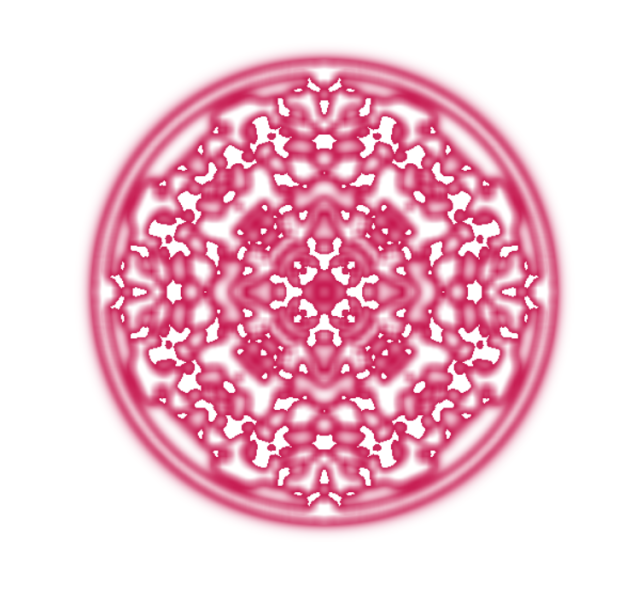

# Mystery Art

Mystery generative art I conjured up for no particular reason.

## Samples

The following samples were generated from a starting geometric shape.

### Circle

https://r2dev2.github.io/MysteryArt?start=circle

## Algorithm

The algorithm is fairly simple:

1. let S(t) be the state of the picture in the form of the opacity of each pixel
2. let S(0) be any geometric shape
3. let S(t + 1) = (opacity increase factor = 1.5) * (the average opacity of neighbors in a square around the pixel) for each pixel in S(t)
